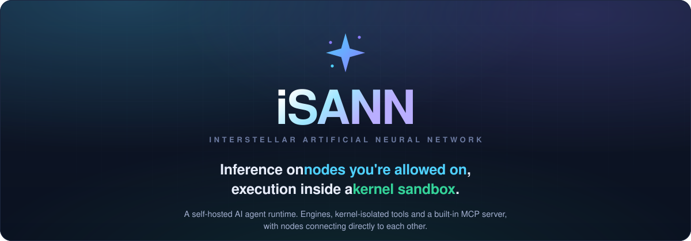
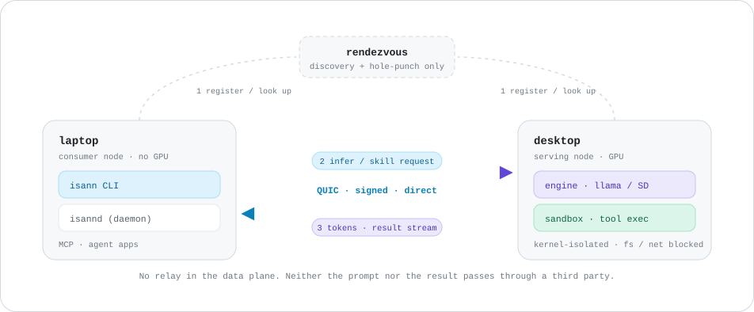
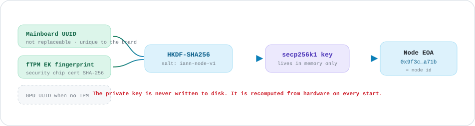

<p align="center">
  
</p>

<p align="center">
  <b>Many nodes are linked across the iSANN network.</b><br>
  Of those, the only ones where inference and skills actually run are your own nodes<br>
  and the nodes opened to you, and that execution never leaves the kernel sandbox.
</p>

---

## Your own hardware is the agent runtime

You never hand your model to anyone else. Engines run in containers on your own GPU, and every tool an agent calls runs only inside a sandbox the kernel itself guards. The node you build this way is then called, as it is, by your other machines and by nodes you have access to.

| ⚙️&nbsp; **Engine lifecycle** | 🧠&nbsp; **Eight asset kinds, one set of rules** | 🛡️&nbsp; **Kernel-isolated execution** |
|---|---|---|
| Define llama.cpp, Stable Diffusion or vLLM with the four-file manifest convention and the daemon takes it from there: docker creation, startup, warm-up and status reporting. | From engines and models to skills and presets, all eight kinds share the same rules: a content-hash id and a provenance index. Where something came from and what changed stays traceable. | Tools only ever run inside a sandbox where the OS kernel itself blocks file and network access. The boundary sits one layer below the container. |
| `isann docker create llama` | `isann <kind> pull · list · rm` | `policy · deny-by-default` |

### Eight standard asset kinds

All under the same rules: content-hash id, provenance index, `<kind>:<id>` reference syntax, and the same CLI.

| | | | |
|---|---|---|---|
| **engine**<br><sub>Inference engine definition<br>`manifest + compose + .env + run.sh`</sub> | **model**<br><sub>Weights<br>loaded from HuggingFace or local disk</sub> | **tool**<br><sub>A capability an agent calls<br>`tools.json`</sub> | **skill**<br><sub>Procedural knowledge for a situation<br>`SKILL.md`</sub> |
| **recipe**<br><sub>Declares the state a node should reach<br>`.ian`</sub> | **mesh**<br><sub>Backend apps a node runs<br>`mesh.json`</sub> | **preset**<br><sub>Inference parameter sets<br>keyed per engine</sub> | **profile**<br><sub>Engine runtime settings<br>`.env`</sub> |

**Plug them in, pull them out.** All eight attach with `pull` and detach with `rm`, and you never have to rebuild the node to do it. Every one of them can be published to the market and installed on another node with a single `isann market install`.

---

## Inference and skills both travel peer to peer

You type on the laptop and the desktop GPU answers. Nothing relays in between. The rendezvous only helps the two find each other; once the path opens, all that is left is a direct QUIC link between the nodes. The node on the other end may be another machine of yours, or one somebody opened to you. The route is identical either way. The only difference is what that node lets you do.

<p align="center">
  <picture>
    <source media="(prefers-color-scheme: dark)" srcset="./assets/p2p-dark.svg">
    
  </picture>
</p>

| | |
|---|---|
| **1 · They find each other** | Nodes register with the rendezvous, and hole-punching opens a path even from behind NAT. That is the whole of what the rendezvous does. |
| **2 · They connect directly** | From then on the nodes speak QUIC to each other. A signed request tells the other node who is calling. |
| **3 · It runs right there** | Inference on that node's GPU, skills and tools in that node's kernel sandbox. Only the result streams back. |

```console
# register the desktop under an alias and make it the default
$ isann favorite add --alias desktop --nodeid s:0x9f3c…a71b
$ isann favorite use --alias desktop

# inference: you ask from the laptop, the desktop GPU answers
$ isann infer run --engine llama --prompt "summarize this log"

# an agent run takes the same path, and its tools run in the desktop's sandbox
$ isann agent run --engine llama --prompt "audit this repo"
```

### Skills your agent calls travel the very same path

The daemon ships with an MCP server built in. Attach any MCP-capable agent or editor to a node and the skills it calls **do not stop at your machine**. They cross to a remote node over P2P and run in that node's sandbox. From the agent's side it simply called a tool. All that changed is whose kernel it ran inside.

`MCP client` → `isannd (built-in MCP server)` → **`P2P · direct QUIC`** → `remote node sandbox`

---

## How this differs from things that look similar

Plenty of projects carry the words "distributed AI", and each of them is solving a different problem. What follows is not a claim that one is better than another. It is a map of where iSANN stands.

| | What it solves | Where inference runs | What it is good at | Where iSANN differs |
|---|---|---|---|---|
| **iSANN** | Making your own machines into one agent runtime | Your nodes and nodes you are allowed on | Engine management, kernel-isolated execution, direct node links | *The reference point* |
| **OpenClaw** | Driving a personal agent from a messenger | Mostly external model APIs (your own keys) | Deep channel integration and session handling | Runs the model on your node instead of calling an API |
| **Ollama / LM Studio** | Running models locally with little setup | One machine of yours | The simplest install and model management there is | Reaches past one machine, and covers tool execution too |
| **io.net / Vast.ai** | Renting as much GPU as you need | Rented GPUs | Large amounts of GPU available on demand | Uses hardware you own, and nothing leaves it |
| **Exo** | Running a large model across small devices | Split across devices | Fits a model no single machine could hold | Never splits a model; what moves between nodes is the request |
| **AI Horde** | Letting anyone run inference for free | An anonymous resource pool | No barrier to entry and no cost | Each node's owner decides who gets in |

**Your own machines, not rented ones.** This is not about renting a stranger's GPU. What you connect to is hardware you own, or a node somebody opened to you.

**Models are never split.** A single model is never spread across machines. One node runs one model whole, and what travels between nodes is the request.

**The kernel draws the line.** Tools that only do inference have no notion of execution at all, and agent gateways usually stop at the container. In iSANN the kernel itself draws the file and network boundary.

**The owner holds the door.** A node runs either **public**, open to anyone, or **protected**, where only signers the owner has registered by role (owner / admin / user) get through.

---

## A node's identity is the machine itself

It is not an ID handed to you when you register an account. A node's address is computed from the mainboard and the security chip. There is no file to steal, and the address holds unless the machine physically changes.

<p align="center">
  <picture>
    <source media="(prefers-color-scheme: dark)" srcset="./assets/nodeid-dark.svg">
    
  </picture>
</p>

| | |
|---|---|
| **Swap the disk and it stays** | Reinstall the OS or replace the SSD and the address is unchanged, because identity here is computed rather than stored. |
| **There is no file to copy** | Steal a key file, move it to another machine, and it still is not that node. A different fingerprint yields a different address. |
| **A record belongs to the machine** | What a node has done belongs to one piece of hardware rather than a disposable account. Throwing it away and starting over means starting from nothing. |
| **It still finds you when the IP changes** | What you call is the node id, not an IP. Move from home to a café, or let the router pick up a new address, and the same id still reaches it. You get what a static IP would give you without paying for one. |

> **The address only changes in two cases.** Replacing the mainboard changes the System UUID, and the address changes with it. Replacing the graphics card matters only for nodes derived from a GPU UUID because they have no security chip.
> Put the other way round: as long as you do not physically change the hardware, the address stays exactly where it is.

---

## Share your node and earn

A node that is useful to others gets paid for it. Nothing here asks you to buy anything first: **every credit starts as work a node actually did.**

| | | |
|---|---|---|
| 🔍&nbsp; **Earn by answering** | 🤝&nbsp; **Get paid for what you serve** | 🔁&nbsp; **Spend it on other nodes** |
| Leave your node open to the public. A **prober** node comes by, asks your engine a question, and writes you a **receipt** when you pass. Collect receipts, claim them, and they turn into credit. | When someone runs inference or a skill on your node, they set a budget once and sign a running total as they use it. You collect that total later, so no call waits on a payment to clear. | Credit you earned pays for inference and skills on nodes you do not own. The more you share, the more you can call. |
| <sub>What gets paid is **"answered when asked"**, not owning a GPU. An idle machine earns nothing.</sub> | <sub>Receipts add up instead of piling up one per call, so a dropped one costs nothing: the next covers it.</sub> | <sub>Serving and calling use the same credit. There is no second currency to convert through.</sub> |

**Nothing to set up.** A node registered with a rendezvous and open in public mode is already ready to be checked. There is no roster to fetch and no config file to keep.

```console
# where your node stands: slot, last probe, receipts held
$ isann faucet

# turn the receipts you have banked into a signed voucher
$ isann faucet issue
```

**Credit is earned, never sold.** Nothing is minted in advance. Credit appears only when a node proves it was useful, and it becomes withdrawable only after it has paid for real work on somebody's node. There is no stockpile behind it to sell.

<sub>Receipts and vouchers work today. Spending credit on another node's inference and skills opens with per-call payment in 2027.</sub>

---

## Repositories

One runtime distribution, the backend apps nodes run, and the asset repositories that nodes pull from. Of the eight asset kinds only **model** is absent here, because weights come straight from HuggingFace or local disk.

| | |
|---|---|
| **[isann](https://github.com/isannai/isann)** · `runtime`<br>The runtime distribution. Daemon, CLI and version manager (ivm) binaries ship here as releases.<br><sub>`ivm install`</sub> | **[bootstrap](https://github.com/isannai/bootstrap)** · `install`<br>One-line installers for Windows and Linux. They fetch ivm, install the runtime, register the service and point you at a recipe. Start from this one.<br><sub>`get-isann.ps1 · get-isann.sh`</sub> |
| **[engines](https://github.com/isannai/engines)** · `engine`<br>Inference engine bundles. llama.cpp, Stable Diffusion, vLLM and CLIP, each defined by the four-file convention.<br><sub>`isann engine pull https://github.com/isannai/engines/tree/main/llama --name llama`</sub> | **[mesh](https://github.com/isannai/mesh)** · `backend`<br>The apps a node runs beside its engines: station serves your engines to other nodes, probe checks nodes for the faucet, control is the console. The daemon starts them.<br><sub>`isann mesh start station`</sub> |
| **[recipes](https://github.com/isannai/recipes)** · `asset`<br>Brings a node to the state you want in one command, from pulling a model to starting the engine and joining a rendezvous.<br><sub>`isann recipe exec install-llama-small`</sub> | **[skills](https://github.com/isannai/skills)** · `asset`<br>Procedural knowledge an agent loads when the situation calls for it (`SKILL.md`), together with the tool references it needs.<br><sub>`isann skill pull <url>`</sub> |
| **[tools](https://github.com/isannai/tools)** · `asset`<br>Tool definitions (`tools.json`). The unit an agent actually calls, and running one always has to clear the sandbox policy first.<br><sub>`isann tool pull <url> --name <name>`</sub> | **[presets](https://github.com/isannai/presets)** · `config`<br>Bundle temperature, top-p, context and the like under one name per engine, and requests pick them up on their own.<br><sub>`isann preset pull <url>`</sub> |
| **[profiles](https://github.com/isannai/profiles)** · `config`<br>Engine runtime profiles (`.env`). For running the same engine several ways by changing only the model, memory or batch size.<br><sub>`isann profile use --engine llama --name small`</sub> | |

---

## From zero to your first inference

**1 · Install.** One line fetches ivm, installs the runtime and registers the service.

```powershell
# Windows (PowerShell)
irm https://raw.githubusercontent.com/isannai/bootstrap/main/get-isann.ps1 | iex
```

```sh
# Linux
curl -fsSL https://raw.githubusercontent.com/isannai/bootstrap/main/get-isann.sh | sh
```

**2 · Pick a recipe.** It downloads the model, starts the engine and the station, and joins a rendezvous.

| Recipe | What you get | GPU |
|---|---|---|
| `isann recipe exec install-llama-small` | Qwen2.5-1.5B text | VRAM 4 GB+ |
| `isann recipe exec install-llama-medium` | Qwen2.5-14B text | VRAM 12 GB+ |
| `isann recipe exec install-sd-small` | Stable Diffusion 1.5 images | VRAM 4 GB+ |
| `isann recipe exec install-passenger` | Use other nodes only, run nothing locally | none |

**3 · Infer.**

```console
$ isann infer run --engine llama --prompt "hello"
```

---

## Roadmap

What ships next. Timing may shift as things evolve.

<table>
<tr>
<td width="50%" valign="top">

**`Q4 2026`  Open**

<sub>Standing up and operating a node goes public.</sub>

- **Install** with one line, and **ivm** to install, switch and run versions as a service
- **Engine lifecycle** over docker: llama.cpp, Stable Diffusion, vLLM
- **Direct node-to-node links**: QUIC, NAT hole-punching, cross-node commands
- **Node identity derived from hardware**
- A **built-in MCP server**, plus agent, tool and skill execution
- **Eight asset kinds** under one set of rules, published and installed through the **market**
- **Earn**: probers check nodes and write receipts that turn into credit

</td>
<td width="50%" valign="top">

**`2027`  Share across the network**

<sub>What it takes to call and pay a node you have never met.</sub>

- **Per-call payment**: you can already price a skill and list it; this is where the price actually gets collected. What moves is credit. You spend the credit you earned to call someone else's inference or skill, and credit comes in when yours is called. The node says how much first, and the caller sends the request again with the payment attached.
- **Multiple rendezvous**: today only nodes on the same rendezvous can find each other. You will reach a node whatever rendezvous it sits on and connect to it directly, without registering there yourself.

</td>
</tr>
</table>

---

<p align="center">
  <sub><b>iSANN</b> · Interstellar Artificial Neural Network &nbsp;·&nbsp; MIT License &nbsp;·&nbsp; Go 1.25 &nbsp;·&nbsp; Windows · Linux</sub>
</p>
